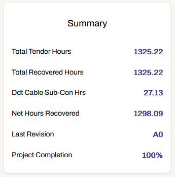
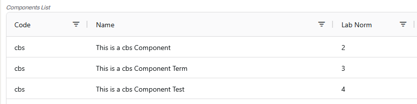
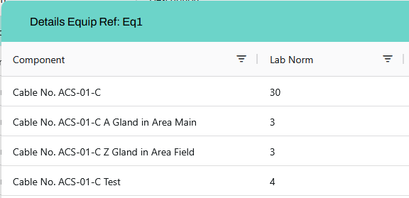

# User Manual

 

This application is designed to help you manage project-related data easily and efficiently.

The **core feature** is the edition of the completion (%) of items of Equipment (Components and/or Cables).
The dashboard contains a summary section in which you can see the project information and keep track of its completion:

<iframe src="https://player.vimeo.com/video/1060111523?h=1e6b339d47&amp;title=0&amp;byline=0&amp;portrait=0&amp;badge=0&amp;autopause=0&amp;player_id=0&amp;app_id=58479" frameborder="0" allow="autoplay; fullscreen; picture-in-picture; clipboard-write; encrypted-media" style="position:absolute;top:0;left:0;width:100%;height:100%;" title="Tickbook App - Main Feature"></iframe>

_Quick overview of the main feature to track project progress_

 

---

## **Application Workflow**

 

The application allows you to (in this recommended order):

-   Create/open a Project
-   Manage Components
-   Manage Templates of Components
-   Manage Equipment (made of Templates of Components)
-   Optionally add Cables to Equipment
-   Update the progress of items of Equipment (Components/Cables) easily

  
<i>View Video: Quick overview of the application workflow 🔊</i>

<iframe src="https://player.vimeo.com/video/1060111649?h=896db7be93&amp;title=0&amp;byline=0&amp;portrait=0&amp;badge=0&amp;autopause=0&amp;player_id=0&amp;app_id=58479" frameborder="0" allow="autoplay; fullscreen; picture-in-picture; clipboard-write; encrypted-media" style="position:absolute;top:0;left:0;width:100%;height:100%;" title="Tickbook App - Workflow for New Project"></iframe>

Among some extra features: Excel spreadsheets imports, full project and Dashboard tables data exports (Excel spreadsheets), multi-Equipment update, creating and lifting CCs, Revisions (logs of some specific project changes and user actions )...

> 🔴 In each Excel spreadsheet, the required columns have a red background: you must provide a value for these fields. Other fields are optional.

 

---

## **Views explained**

 
### **Dashboard**

This is the main tab of the application, in which you can track and update the completion of items of Equipment and get a quick overview of the project progress with some key metrics in the "Summary" section:

-   The top table (called "Main Table") represents the Equipment list (with all Components and Cables grouped by Equipment Reference).
    Clicking on a row opens a dialog box that shows the list of Components and/or Cables for this Equipment, and you can edit their completion (individually by clicking on a completion field, or selecting multiple ones holding <kbd>Ctrl</kbd> or <kbd>Shift</kbd> and using the form).

-   The bottom table (called "View Table") helps visualising data differently based on the selected view (view by Section groups Equipments by Section instead of by Ref for example). Clicking on a row opens a dialog box (except for views Area and Labour-Material) that shows the list of Components and/or Cables, but completions are not editable from there.

In these tables, and in most tables in the application, you can:

-   Sort the data by clicking on a column header (hold <kbd>Shift</kbd> to sort by multiple columns)
-   Filter the data using individual search fields in each column
-   Temporarily rearrange the order of the columns by dragging the column headers
-   Temporarily remove a column from the table by dragging the column header out of the table
-   Resize the columns width

> ℹ️ The search field at the top right allows you to search for a value in every columns directly.

 

### **Components**

-   **Create one Component**: Use the form to create one Component. For Cable Components (code "cbs"), three Components are created at once: the base, the Term and the Test.

-   **Create several Components**: Use the relevant spreadsheet to create several Components at once.

    > ℹ️ Cable Components (code "cbs") cannot be created that way, you must use the form.

-   **Edit Components**: Edit Components details (or only their Code, if they are already used in a Template).

    > ℹ️ Cable Components (code "cbs") are not editable (they will be ignored in the "Update Multiple Codes" function described just below).

-   **Edit Components Codes**: Select one or several Components (holding <kbd>Ctrl</kbd> or <kbd>Shift</kbd> ) and change their Codes all at once using the form.
-   **Delete Components**: Only possible if they are not used in a Template.

    > ℹ️ For Cable Components (code "cbs"), you must delete the "base" Component to delete the Term and Test ones automatically. Only possible if they are not used in the Cable Schedule.

  
<i>View Video: Components Demo</i>

<iframe src="https://player.vimeo.com/video/1060111443?h=f13204188e&amp;title=0&amp;byline=0&amp;portrait=0&amp;badge=0&amp;autopause=0&amp;player_id=0&amp;app_id=58479" frameborder="0" allow="autoplay; fullscreen; picture-in-picture; clipboard-write; encrypted-media" style="position:absolute;top:0;left:0;width:100%;height:100%;" title="Tickbook App - Components"></iframe>

 

### **Templates**

-   **Create one Template**: Add/remove Components by clicking on them in each box (you can also change their order) then use the form to create a Template with selected Components.

-   **Create multiple Templates**: Use the relevant spreadsheet to create several Templates. This will create new Components automatically if they did not exist already, and optionally create Equipment if some equipment quantity (EquipQty) is provided.

-   **Edit Templates**: Add/remove Components, or change their order (the order in the Template determines the order in the Equipment Details dialog box in the Dashboard).

-   **Duplicate Template**: The duplicated Template will have the same name with an added "x" at the end.

  
<i>View Video: Templates Demo</i>

<iframe src="https://player.vimeo.com/video/1060111600?h=390545cff8&amp;title=0&amp;byline=0&amp;portrait=0&amp;badge=0&amp;autopause=0&amp;player_id=0&amp;app_id=58479" frameborder="0" allow="autoplay; fullscreen; picture-in-picture; clipboard-write; encrypted-media" style="position:absolute;top:0;left:0;width:100%;height:100%;" title="Tickbook App - Templates"></iframe>

 

### **Equipment**

> ℹ️ The Equipment list of the project is not visible here but in the Dashboard, as it is the main source of data of a project.

-   **Create one Equipment**: Use the form to create one Equipment (you must have created Components and Templates). You can see the list of Components in the selected Template in the upper section of the page.

-   **Create multiple Equipment**: Use the relevant spreadsheet to create several Equipments.

    > ℹ️ If the provided quantity EquipQty is higher than one, it will automatically create several items of Equipment with the same data, with different numbers added at the end of the Ref to differentiate them.

-   **Edit one Equipment**: Right click on the row you want to manually edit in the Equipment list (Dashboard)

-   **Edit one field for several Equipments**: Export "Main table data", add a new column at the second position in the spreadsheet and give it the name of the field you want to update (Ref, Description, Area, Section), then load this file in the Equipment page.

-   **Delete Equipment**: Right click on the row you want to delete in the Equipment list (and optionnally delete the associated Cables too).

-   **Track Completion**: Update completion percentages for equipment and track progress.

  
<i>View Video: Equipment Demo</i>

<iframe src="https://player.vimeo.com/video/1060111485?h=8302a8e168&amp;title=0&amp;byline=0&amp;portrait=0&amp;badge=0&amp;autopause=0&amp;player_id=0&amp;app_id=58479" frameborder="0" allow="autoplay; fullscreen; picture-in-picture; clipboard-write; encrypted-media" style="position:absolute;top:0;left:0;width:100%;height:100%;" title="Tickbook App - Equipment"></iframe>

 

### **Cable Schedule**

-   **Create one Cable**: To create a Cable you must have created Components with code "cbs" first, and have created at least one Equipment too.

    The LabNorms of the four parts of a Cable are determined as follows (see example images below):

    -   LabNorm of the "base" cbs Component \* Cable Length (2 \* 15 = 30)
    -   LabNorm of the "Term" cbs Component for the A Gland (3)
    -   LabNorm of the "Term" cbs Component for the Z Gland (3)
    -   LabNorm of the "Test" cbs Component for the Test (4)
    

        
        
    

-   **Create multiple Cables**: Use the relevant spreadsheet to create several Cables.

-   **Edit Cables**: Edit Cables details (associated Equipment will be automatically updated).

-   **Edit Cables Completion**: You can edit the four completion fields of a Cable by clicking directly on them, as shown in the video below (they are also editable in the Equipment Details dialog box). When the completion (Cable % Complete) is 100%, the Cable is ready to be tested (yellow background for Test % Comp) and you can also mark it as installed by a sub-contractor (right click on the row). When all the values are 100%, the row turns green which helps you to quickly identify fully completed Cables.

-   **Delete Cables**: Right click on the row you want to delete (associated Equipment will be automatically updated).

-   **Mark Cables as Installed**: Mark Cables as installed by sub-contractor ("Ddt Cable Sub-Con Hrs" in Dashboard)

  
<i>View Video: Cable Schedule Demo</i>

<iframe src="https://player.vimeo.com/video/1060111351?h=3d25f6cea3&amp;title=0&amp;byline=0&amp;portrait=0&amp;badge=0&amp;autopause=0&amp;player_id=0&amp;app_id=58479" frameborder="0" allow="autoplay; fullscreen; picture-in-picture; clipboard-write; encrypted-media" style="position:absolute;top:0;left:0;width:100%;height:100%;" title="Tickbook App - CableSchedule"></iframe>

 
### **Exporting Data**

Export project data such as:

-   Main table data of the Dashboard (Equipment list)
-   Bottom table data of the Dashboard, based on the current selected view
-   Full project data

 
### **Revisions**

Track main changes made to the project and maintain a history of updates. You can create a Revision when creating an Equipment, or assign a new Revision to an existing Equipment when you edit it. Some important project changes automatically create a Revision, such as operations on Equipment, or spreadsheets imports. The most recent Revision that is not 't.b.a' is displayed in the Summary section.

 
### **Multi-Update**

Select all the Equipment you want to update in the Area/Section of your choice, add a completion value to the Components Codes, and submit the form to update all the corresponding items at once.

  
<i>View Video: Multi-Update Demo</i>

<iframe src="https://player.vimeo.com/video/1060111545?h=6a0ec6f8ac&amp;title=0&amp;byline=0&amp;portrait=0&amp;badge=0&amp;autopause=0&amp;player_id=0&amp;app_id=58479" frameborder="0" allow="autoplay; fullscreen; picture-in-picture; clipboard-write; encrypted-media" style="position:absolute;top:0;left:0;width:100%;height:100%;" title="Tickbook App - Multi-Update"></iframe>

 
### **CCs (Contract Communications)**

Create a CC for one or several Equipments, then track its status (Current or Lifted). Pick a date to automatically lift the CC. Remove the date to automatically set the status back to Current. You can filter Equipment list to show only rows associated to a CC with status "Current" in the Dashboard:

  
<i>View Video: CCs Demo</i>

<iframe src="https://player.vimeo.com/video/1060111396?h=45b4705617&amp;title=0&amp;byline=0&amp;portrait=0&amp;badge=0&amp;autopause=0&amp;player_id=0&amp;app_id=58479" frameborder="0" allow="autoplay; fullscreen; picture-in-picture; clipboard-write; encrypted-media" style="position:absolute;top:0;left:0;width:100%;height:100%;" title="Tickbook App - CCs"></iframe>

 
### **Tender Sections**

See all the tender sections of the project, their individual hours, and the total. By default when creating an Equipment, its tender section is set to "t.b.a". You can set a new value when updating Equipment (right click on a row in the main table of the Dashboard). Setting it back to "t.b.a" will remove its hours from the tender sections total.

 
### **Projects**

Open an existing Project or create a new one. Always ensure that the correct project is opened before making any updates or changes (the app automatically loads the last opened project).

> ℹ Except for Codes, all the data you can then see in the application belongs only to the opened Project.

 
### **Codes**

Displays the full list of Codes, with their corresponding name. You can also create a new Code if needed.

 

---

## **Bulk Operations via File Upload**

 

The application supports bulk creation and/or updates (see above). To use this feature:

1. Download the provided spreadsheet template.
2. Fill in the required fields (columns with a red header are required).
3. Upload the completed file in the relevant section of the application.

 

---

## **Notes for Users**

 

-   Always ensure that you select the correct project before making any updates or changes.
-   Use the export feature to back-up important project data regularly.
-   If you encounter errors during bulk uploads, review the error messages provided to identify and fix issues (hover the notification with the mouse to see the details).

For further assistance on how to use the application or on its development or maintenance, please contact:
<a href="mailto:vincent.seube@b-gen.co.uk">vincent.seube@b-gen.co.uk</a>

For any authentication related issues or server errors, please contact the IT department.
